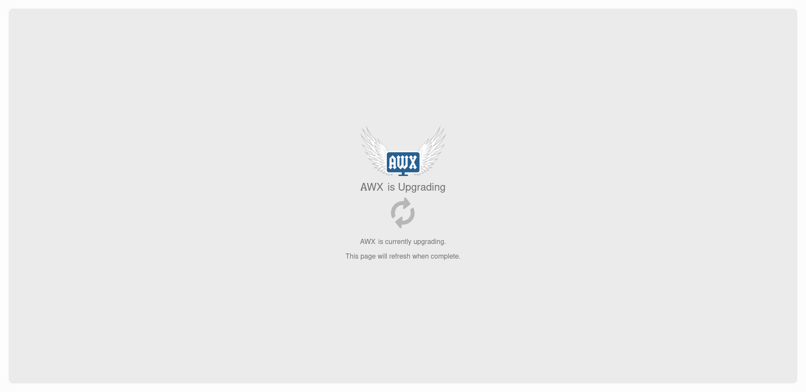
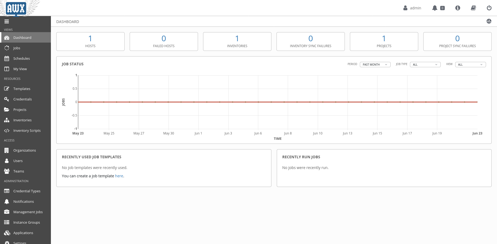

# Micro-awx

Vagrant environment for [Awx](https://github.com/ansible/awx) and [Gitlab](https://gitlab.com).


## Getting Started

Download and install vagrant from the [official page](https://vagrantup.com/downloads.html).
You can easly create all the machines by running

```sh
~ $ vagrant up
```

## Awx

To start awx run


``` sh
~ $ vagrant up awx
```

Open the browser at http://192.168.50.10 and wait until the migration is done.



After the migration is over the login page will appear, default username and password are `admin` `password` and you are done!



## Gitlab
> Note: The Gitlab installation can take some time

To start gitlab and runner run


```sh
~ $ vagrant up gitlab runner-1
```

After Gitlab started you can find at http://192.168.50.11, set the new password, the admin username is `root`. For registering the runner check the official documentation, [here](https://docs.gitlab.com/runner/register/).


## Windows VMs

> Note: the import and the creation of the virtual machine can be really slow

To use windows you need additional steps: download the official vagrant box from
the [microsoft
website](https://developer.microsoft.com/en-us/microsoft-edge/tools/vms/) and import the vagrant box (*renamed windows10.box*):

``` sh
~ $ vagrant box add Win10.box --name windows10
```

Install the additional vagrant plugin for winrm:

``` sh
~ $ vagrant plugin install winrm winrm-fs
```

Start the windows vm with

``` sh
~ $ vagrant up target-windows-1
```

To connect with ansible to a windows machine you need the following
dependencies:

``` sh
~ $ pip install pywinrm
```

To execute commands inside the vm you can use the winrm module:

``` sh
~ $ vagrant winrm --shell powershell --command "Get-NetIPAddress"
```


### Useful links for windows

[Windows setup guides](https://docs.ansible.com/ansible/latest/user_guide/windows.html#windows)

[Using Ansible and Windows](https://docs.ansible.com/ansible/latest/user_guide/windows_usage.html)

[Windows modules](https://docs.ansible.com/ansible/latest/modules/list_of_windows_modules.html)

